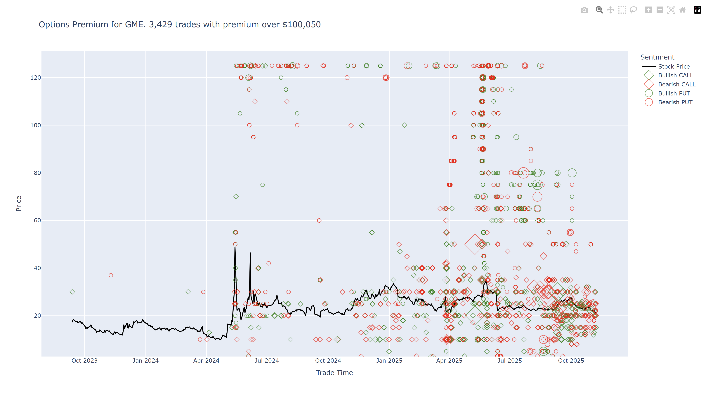

Generates an chart of options premium using ThetaData

# Install

To install using `uv` in a test environment:

```
mkdir test-options-premium-chart-app
cd test-options-premium-chart-app
uv venv
.\.venv\Scripts\activate
uv pip install "git+https://github.com/dharmatech/options-premium-chart-td"
```

# Run

To run:

```
python -m options_premium_chart_td.main --premium-threshold 100000 GME
```

# Result

The script will generate an file: `options_premium_chart_GME.html`.

